# Project Phobia

The goal of our project is to develop an AI-driven application capable of filtering video content for users based on two main criteria: parental controls and phobia triggers. By utilizing machine learning models, the system can detect and filter 19 specific elements such as weapons, smoking, nudity, spiders, snakes, heights, and more. The application helps parents protect children from inappropriate content and assists individuals with specific phobias by filtering out triggering visuals. This is achieved by identifying the undesired content and applying filtering techniques such as grayscale, blurring, or darkening parts of the video.

The project has been successfully completed with the support of TÜBİTAK.

## What I have done in this project:
In this project, I established a dataset development team and led the selection of model architectures, overseeing the entire process of model training from start to finish. I evaluated model performance, developed strategies for model improvement, and implemented post-processing techniques such as tracking and filtering model results. I served as a Data Scientist in the project.

## Detected Elements

### Medical Fears
- Blood
- Dental Tools
- Doctor's Coat
- MRI Machine
- Syringe

### Phobias
- Heights
- Lightning
- Birds
- Cats
- Dogs
- Insects
- Spiders
- Snakes

### Parental Control Elements
- Alcohol
- Cigarettes
- Weapons
- Fights
- Sexual Content
- Gambling Tools
- Kissing and Gender Detection (Homophobia)
- Marijuana

## Model Architectures in used

- YOLOv8 Seg
- Yolov8 Det
- VideoMAE: Masked Autoencoders are Data-Efficient Learners for Self-Supervised Video Pre-Training

## Demo App
https://apps.apple.com/tr/app/phobia-guard/id6468506743

## Visual Samples

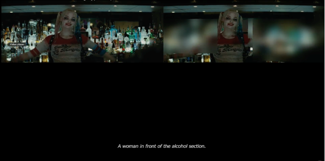
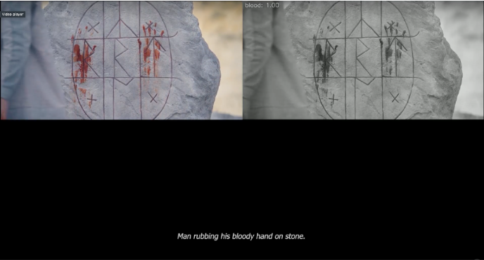
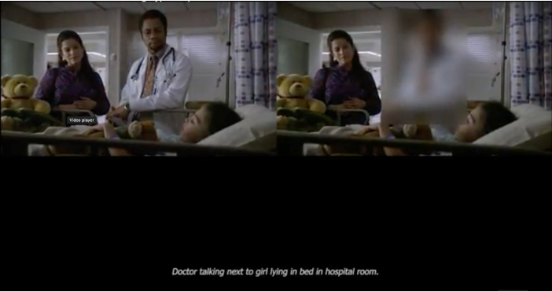
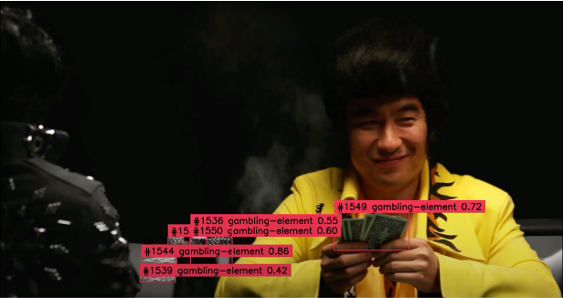
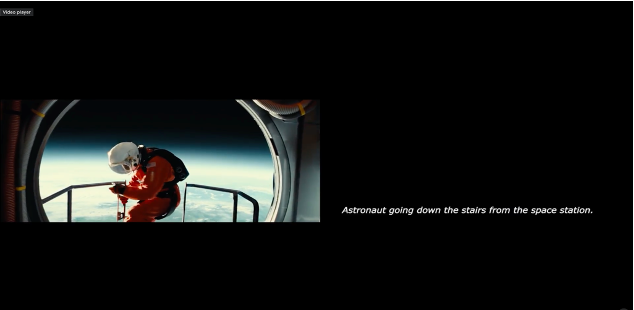
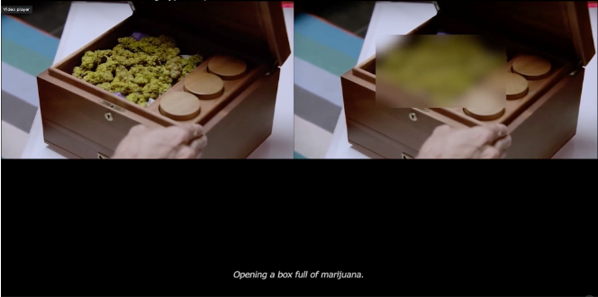
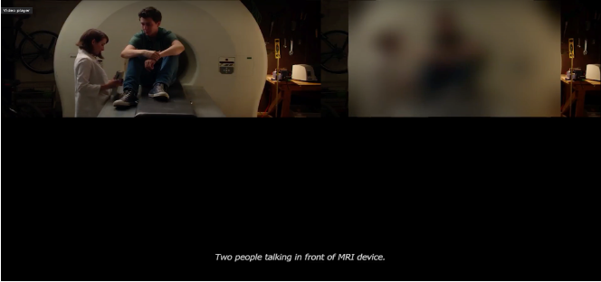
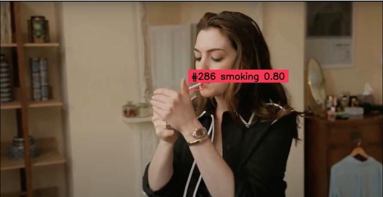
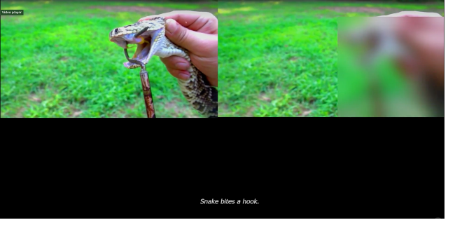
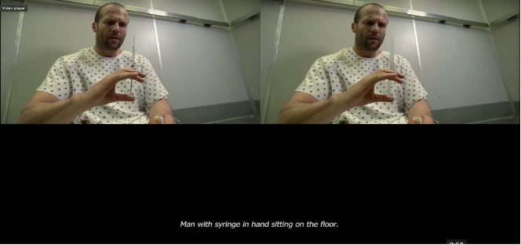
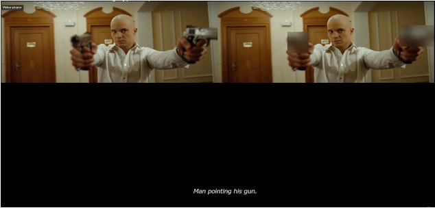